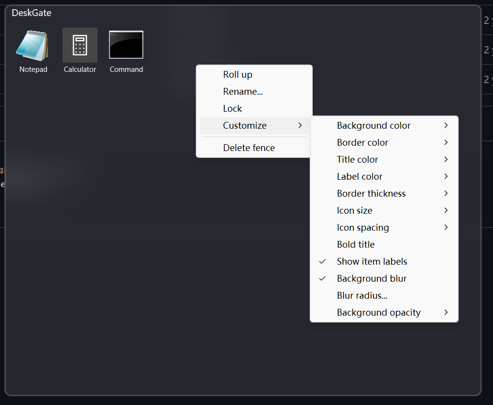

# DeskGate

Desktop shortcut organizer for Windows — lightweight, fast, and written in Rust.

Inspired by [DesktopFences](https://github.com/limbo666/DesktopFences).



## Features

- **Fence panels** — translucent floating panels that sit on your desktop, each holding shortcuts, files, and folders
- **Drag & drop reorder** — rearrange icons within a fence with smooth animated displacement
- **Per-fence customization** — background color, opacity, blur radius, border thickness/color, icon size, text labels, title style
- **Roll-up** — double-click the title bar to collapse a fence down to just its header
- **Edge snapping** — fences snap to screen edges and to each other when dragged
- **Lock mode** — lock a fence to prevent accidental moves and resizes
- **System tray** — new fence, reload configuration, animation FPS presets, default settings for new fences
- **Global hotkey** — `Ctrl+Alt+D` toggles visibility of all fences at once
- **DPI-aware** — per-monitor DPI v2 support, no blurry rendering on high-DPI displays
- **Acrylic blur** — Windows 10/11 backdrop blur with configurable radius, powered by DirectComposition
- **Single-instance** — prevents multiple copies from running simultaneously
- **JSON config** — human-readable `fences.json` and `settings.json` in a portable profile directory

## Requirements

- Windows 10 version 1607 or later
- No runtime dependencies — statically linked except for system DLLs

## Install

Download the latest `DeskGate.exe` from [Releases](https://github.com/kmiit/DeskGate/releases) and place it anywhere. Configuration is stored in `%APPDATA%/DeskGate`.

## Build from source

```bash
git clone https://github.com/kmiit/DeskGate.git
cd DeskGate
cargo build --release
```

The binary will be at `target/release/DeskGate.exe`.

## Usage

- **Create a fence** — right-click the tray icon → *New Fence*, then drag shortcuts and files onto it
- **Customize** — right-click a fence → *Customize* to tweak colors, blur, opacity, icon size, and more
- **Roll up / down** — double-click the title bar or right-click → *Roll up*
- **Lock** — right-click a fence → *Lock* to freeze its position and size
- **Rename** — `Ctrl+Click` the title, or right-click → *Rename...*
- **Reorder icons** — drag an icon within the fence; others slide aside with animation
- **Hide all** — press `Ctrl+Alt+D` or double-click the tray icon

### Configuration files

| File | Purpose |
|------|---------|
| `%APPDATA%/DeskGate/fences.json` | Per-fence layout, items, and appearance |
| `%APPDATA%/DeskGate/settings.json` | App-wide preferences — animation FPS, defaults for new fences |

Set `DESKGATE_PROFILE` to point at a custom profile directory. The app checks:
1. `$DESKGATE_PROFILE`
2. `%APPDATA%/DeskGate`
